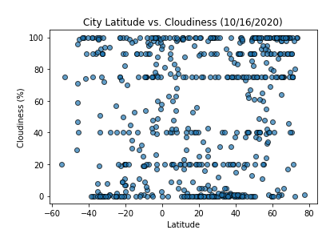
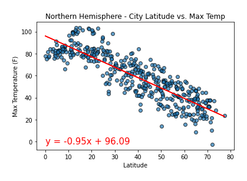

# Python API Challenge
> Application of the skills learned about Python requests, APIs, and JSON traversals. The APIs used are from OpenWeatherMapAPI and Google Places API.

## Table of contents
* [General info](#general-info)
    * [WeatherPy](#WeatherPy)
    * [VacationPy](#VacationPy)
* [Graphs](#Graphs)
* [Observations](#Observations)
* [Vacation Results](#Vacation-Results)
* [Setup](#setup)
* [Status](#status)
* [Contact](#contact)

## General info
"What's the weather like as we approach the equator?"

### WeatherPy
* Create a Python script to visualize the weather of 500+ cities across the world of varying distance from the equator. 
* Analyze the data collected to find relationships between
    * Temperature (F) vs. Latitude
    * Humidity (%) vs. Latitude
    * Cloudiness (%) vs. Latitude
    * Wind Speed (mph) vs. Latitude
* Divide the cities into Northern and Southern Hemisphere accordong to their location and  run linear regression on each of the following relationships:
    * Northern Hemisphere - Temperature (F) vs. Latitude
    * Southern Hemisphere - Temperature (F) vs. Latitude
    * Northern Hemisphere - Humidity (%) vs. Latitude
    * Southern Hemisphere - Humidity (%) vs. Latitude
    * Northern Hemisphere - Cloudiness (%) vs. Latitude
    * Southern Hemisphere - Cloudiness (%) vs. Latitude
    * Northern Hemisphere - Wind Speed (mph) vs. Latitude
    * Southern Hemisphere - Wind Speed (mph) vs. Latitude
    
### VacationPy
Using the data from the list of cities, find vacation spots based on ideal weather. Also find a hotel to stay in those cities.

## Graphs
* Temperature (F) vs. Latitude

* Humidity (%) vs. Latitude

* Cloudiness (%) vs. Latitude

* Wind Speed (mph) vs. Latitude

* Northern Hemisphere - Temperature (F) vs. Latitude

* Southern Hemisphere - Temperature (F) vs. Latitude

* Northern Hemisphere - Humidity (%) vs. Latitude

* Southern Hemisphere - Humidity (%) vs. Latitude

* Northern Hemisphere - Cloudiness (%) vs. Latitude

* Southern Hemisphere - Cloudiness (%) vs. Latitude

* Northern Hemisphere - Wind Speed (mph) vs. Latitude

* Southern Hemisphere - Wind Speed (mph) vs. Latitude

## Observations
* There is a clear correlation bertween Latitude and Temparture in both Northern and Southern hemispheres. The closer you get to the equator, the higher the temparature. 

* There is no correlation between Latitude and Humidity in either hemispheres. However, it's interesting to note that in both hemispheres, a majority of cities had higher humidity. This could be a result of climate change but further tests and sampling over time is required to confirm this. While my sampling has a lower number of cities in the southern hemisphere, looking at the line of regression, we see the y-intercept is around 63F.

* There is no correlation between Latitude and Cloudiness in either hemispheres. 

* There is no correlation between Latitude and Wind Speed in either hemispheres. A majority of the wind speeds in both hemispheres were below 15 mph, probably because we are close to the end of the hurricane/cyclone season.

### Vacation Results
#### Heat Map 
The following heat map that displays the humidity was created for the cities found in the WeatherPy.

#### Vacation Spots
There were 9 cities found that satisfied the ideal weather conditions for vacation spots.

#### Hotel Map
The following map shows the ideal vacation cities with markers for hotels in those cities.

## Setup
Run the following line on gitbash/terminal in order to visualize the maps
    
    jupyter nbextension enable --py gmaps

The following dependencies are required in the code
* matplotlib
* pandas
* numpy
* requests
* time
* scipy.stats

Ideal weather conditions for vacation spots:
* A max temperature lower than 75 degrees but higher than 65.
* Wind speed less than 10 mph.
* Zero cloudiness

## Status
Project was completed on October 16th, 2020

## Contact
Created by [@deepavadakan](https://github.com/)